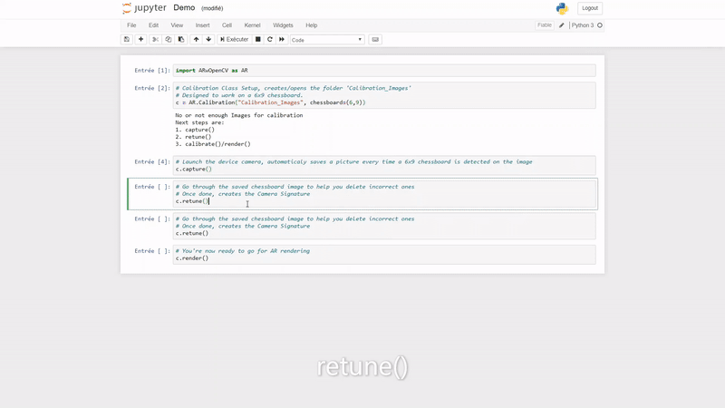

# Welcome to Live AR with OpenCV
### Easy to use open-source implementation for Live Augmented Reality with OpenCV python.

This package provides a solid fundation for Live AR applications in Python via OpenCV. Just calibrate your camera in a few commands then starts displaying 3d shapes on your chessboard. Take a look at the 3d rendering of a plain cube in action (live footage):


Yes, camera calibration seems tedious but this is one shot processand made easy in this package. Then you'll be able to render shapes on live footage.
1. You'll need a black & white chessboard image printed, mine has 6x9 square corners. 
2. Only three lines of code are required to setup a camera signature for further camera calibration.
3. Render

Yes, camera calibration seems tedious but this is one shot processand made easy in this package. Then you'll be able to render shapes on live footage.
1. You'll need a black & white chessboard image printed, mine has 6x9 square corners. 
2. Only three lines of code are required to setup a camera signature for further camera calibration.
3. Render the 3d shape on the chessboard


```python
import ARwOpenCV as AR

# Calibration Class Setup, creates/opens the folder 'dir'
# Designed to work on a 6x9 chessboard.
c = AR.Calibration("dir", chessboard=(6,9))

# Launch the device camera, automaticaly saves a picture every time a 6x9 chessboard is detected on the image
c.capture()

# Go through the saved chessboard image to help you delete incorrect ones
# Once done, creates the Camera Signature
c.retune()

# You're now ready to go for AR rendering
c.render()
```

Let's disect each step with a video tutorial


```python
# Launch the device camera, automaticaly saves a picture every time a 6x9 chessboard is detected on the image
c.capture()
```


```python
# Go through the saved chessboard image to help you delete incorrect ones
# Once done, creates the Camera Signature
c.retune()
```




```python
# You're now ready to go for AR rendering
c.render()
```


# Easy installation with pip:


```python
pip install git+https://github.com/ceddlyburge/python_world#egg=python_world
```

# Why use this library:
The entire implementation is build with several purposes in mind:

- Open-source
- Trasparency
- Ease-of-use
- Performance
- Longevity

To be able to achieve these objectives, this small library is built only on standard python package + OpenCV (most famous image processing library in Python and C++ and proably in the data science community). The idea is then to ensure that the dependecies will be maintained, but also that the usage and modificatiom of the library stays as easy as possible. On top of it the code is kept very simple, with lots of comments, and some smart optimizations.

# Credits:
Lots of credits for these tutorials, unfortunately they were not completly functionnal, that also the reason behind sharing this package, but still great stuffs, I've used a LOT of their existing scripts/ideas - I'll commit some fixes in the tutorials on the OpenCV repositories asap.
- https://docs.opencv.org/master/dc/dbb/tutorial_py_calibration.html
- https://docs.opencv.org/master/d7/d53/tutorial_py_pose.html
